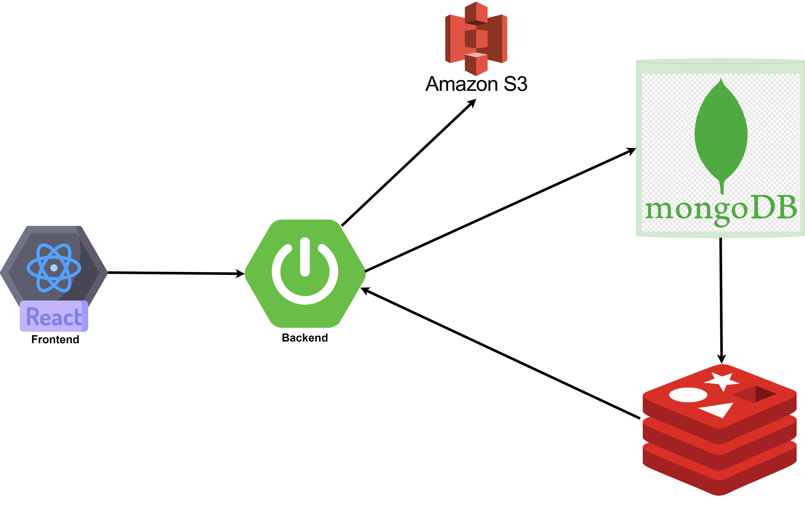
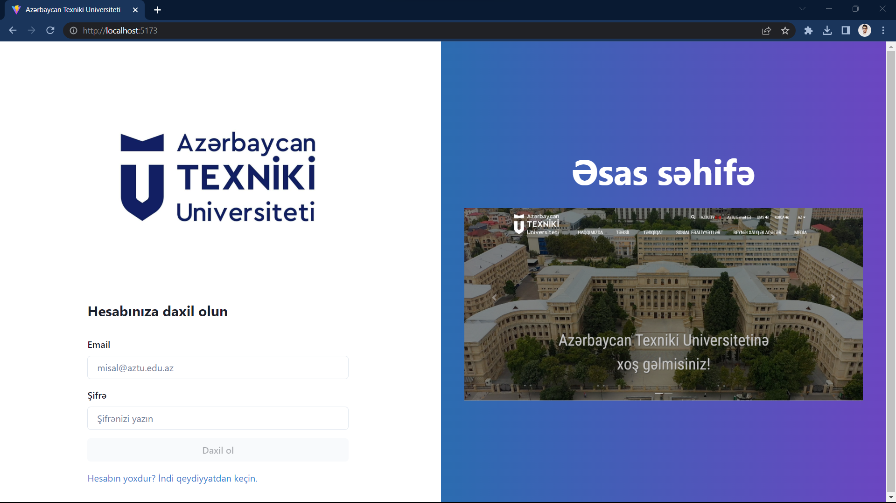
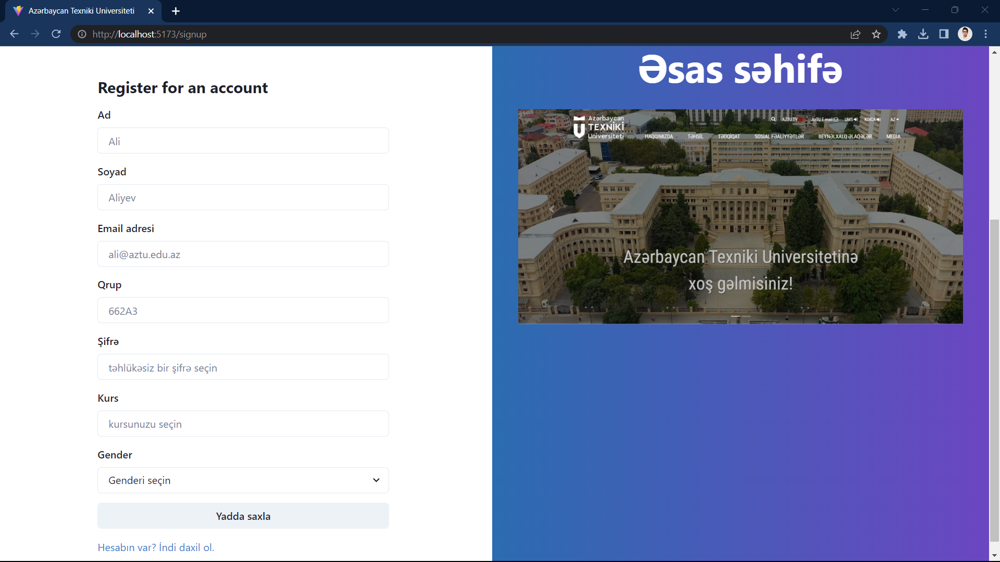
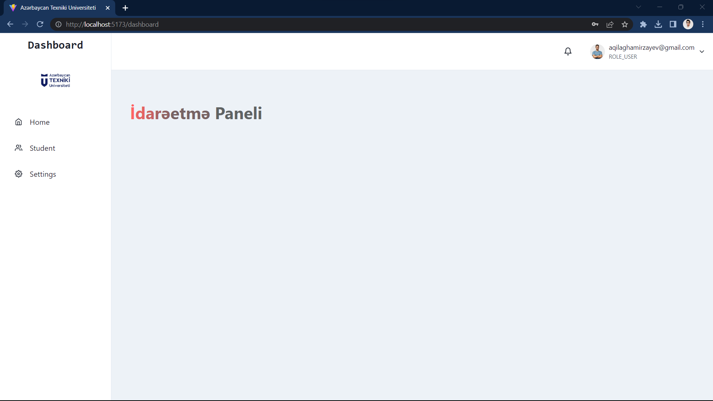
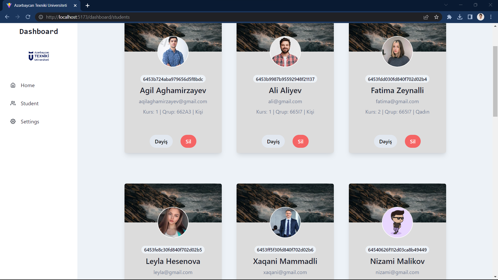
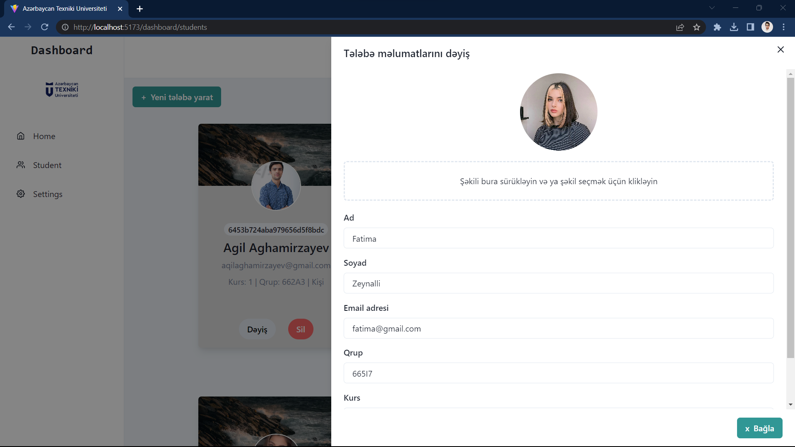

# Tələbə İdarəetmə Sistemi

Bu web applikasiya spring-boot və react-da yazılıb, siz bu saytdan istifadə edərək qeydiyyatdan keçə, sayta login ola, tələbələri yarada, tələbələrin şəkillərini və məumatlarını yarada və dəyişə bilərsiniz

## Xüsusiyyətləri
* İstifadəçinin autentifikasiyası və avtorizasiyası
* Tələbələrin məlumatları üçün CRUD əməliyyatları
* Amazon S3 bucket-ə şəkil əlavə etmək
* Dataları redis keşdə saxlamaq

## İstifadə olunan Texnologiyalar
* Spring Boot
* React
* Spring Security
* Spring Data JPA
* Mapstruct
* Docker
* MongoDb
* Redis
* AWS S3

## Başlamaq üçün:
* `docker compose up`
* `mvn spring-boot:run`
* `npm run dev`

# Ekran görüntüləri

## Giriş Səhifəsi

## Qeydiyyat Səhifəsi

## İdarə paneli

## Tələbə siyahısı

# Tələbəni redaktə et və şəkil əlavə etmək

